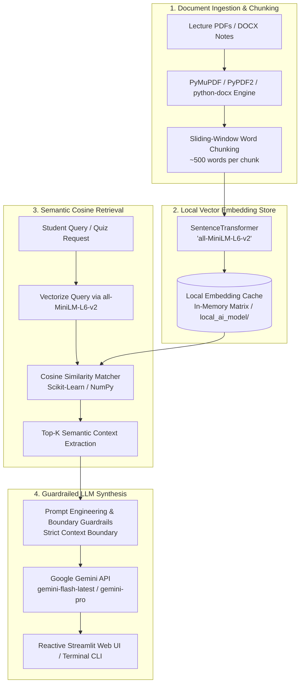

<div align="center">

# 🧠 NeuralNotes

**Local RAG-Powered AI Study Companion & Mock Exam Prep Engine for Engineering Syllabi**

[](https://www.python.org/)
[](https://streamlit.io/)
[](https://ai.google.dev/)
[](https://huggingface.co/sentence-transformers/all-MiniLM-L6-v2)
[](#-technical-architecture)
[](LICENSE)
[](https://github.com/kailash6207/NeuralNotes/pulls)

**NeuralNotes** transforms dense multi-chapter lecture slides, reference textbooks, and question banks into an interactive, hallucination-free study engine. Powered by a local **Retrieval-Augmented Generation (RAG)** pipeline and **Google Gemini**, NeuralNotes gives engineering students rapid exam revision, automated mock quizzes, flashcard decks, and concept simplifications strictly grounded in course materials.

[Key Features](#-key-features) • [Why NeuralNotes](#-why-neuralnotes) • [Technical Architecture](#-technical-architecture) • [Tech Stack](#-tech-stack) • [Quickstart Guide](#-quickstart-guide) • [Study Workflows](#-study-workflows--exam-prep) • [Project Structure](#-project-structure) • [Troubleshooting](#-troubleshooting--faq)

</div>

---

## 📌 Why NeuralNotes?

Engineering curricula (such as university CAT & FAT examinations) cover massive, mathematically rigorous syllabi spanning topics like **VLSI Design, CMOS Circuitry, Digital Signal Processing (DSP), Embedded Systems, Signals & Systems, and Microcontrollers**.

### The Pitfalls of Generic Chatbots:
1. ❌ **Hallucinated Equations & Derivations:** Generic LLMs often fabricate derivations or use differing textbook notations not accepted by your professors.
2. ❌ **No Multi-Document Indexing:** Cannot simultaneously search across 15+ lecture slide decks and reference Word notes.
3. ❌ **Cloud Embedding Costs & Latency:** Uploading documents to cloud embedding APIs incurs rate limits, latency, and subscription fees.

### The NeuralNotes Solution:
**NeuralNotes** implements a strict, closed-loop RAG boundary:
- Text is chunked and vectorized **locally on your machine** using HuggingFace's `all-MiniLM-L6-v2`.
- When you ask a question or request a mock exam, semantic cosine similarity extracts the most relevant source passages.
- Google Gemini is strictly instructed to answer **only from the extracted context**. If a concept isn't in your notes, it will not fabricate an answer.

---

## ✨ Key Features

| Feature | Description |
| :--- | :--- |
| 💬 **Context-Grounded Q&A** | Query any uploaded material. Semantic search retrieves relevant passages and delivers precise answers strictly backed by your course notes. |
| 📝 **Automated Mock FAT Quizzes** | Generates realistic 10-question multiple-choice practice exams formatted in clean Markdown, complete with a hidden answer key and explanations at the bottom for active recall testing. |
| 📇 **High-Yield Flashcard Deck** | Synthesizes rapid-fire revision cards with targeted `Q:` / `A:` pairs covering definitions, acronyms, and critical formulas for last-minute cramming. |
| 👶 **Concept Simplifier (ELI5)** | Breaks down intimidating proofs or principles into intuitive real-world analogies, enforced by **strict mathematical guardrails** that preserve equation accuracy. |
| 📂 **Multi-Format Ingestion** | Upload and index multiple `.pdf` and `.docx` files simultaneously into a single searchable knowledge base. |
| ⚡ **Offline-First Local Embeddings** | Computes vector embeddings locally via `all-MiniLM-L6-v2`, eliminating cloud embedding API latency and subscription costs. |
| 💾 **Persistent Chat Memory** | Saves conversations across browser refreshes via a local JSON cache (`chat_history.json`) with a 1-click hard-drive wipe button. |
| 🖥️ **Dual Interface Support** | Choose between the interactive **Streamlit Web GUI** or the fast, distraction-free **Terminal CLI Tutor** (`tutor.py`). |

---

## 🏗️ Technical Architecture



### Architectural Highlights:
1. **Document Parser (`utils/pdf_engine.py`)**: Dual-engine extractor that automatically prioritizes high-speed **PyMuPDF** (`fitz`) with a graceful fallback to **PyPDF2** and **python-docx**, filtering out empty artifacts and normalizing whitespace.
2. **Chunking Pipeline**: Partitions continuous text into uniform 500-word contextual blocks optimized for transformer attention windows.
3. **Local Embedding Engine (`utils/vector_store.py`)**: Computes 384-dimensional dense vectors using `all-MiniLM-L6-v2`. Embeddings are cached locally in `local_ai_model/` with Windows symlink protections pre-configured.
4. **Cosine Matcher**: Computes dot-product cosine similarity between query vectors and document chunk embeddings to isolate the highest-scoring source material in milliseconds.
5. **Guardrailed Synthesis (`app.py` & `tutor.py`)**: Prompts Google Gemini with strict negative constraints ("Answer ONLY based on context; if missing, state you don't know") to eliminate hallucination risk.

---

## 💻 Tech Stack

- **Core LLM Engine**: [Google Gemini API](https://ai.google.dev/) via the official `google-genai` SDK (`gemini-flash-latest` / `gemini-pro`)
- **Local Embeddings**: [SentenceTransformers](https://sbert.net/) (`sentence-transformers/all-MiniLM-L6-v2`)
- **Vector Math**: [Scikit-Learn](https://scikit-learn.org/) (Cosine Similarity) & [NumPy](https://numpy.org/)
- **Document Extractors**: [PyMuPDF](https://pymupdf.readthedocs.io/), [PyPDF2](https://pypdf2.readthedocs.io/), and [python-docx](https://python-docx.readthedocs.io/)
- **Frontend UI**: [Streamlit](https://streamlit.io/) (Wide layout, reactive state, custom sidebar)
- **Runtime**: Python 3.9+ (Windows, macOS, Linux compatible)

---

## 📂 Project Structure

```text
NeuralNotes/
│
├── 📄 app.py                  # Main Streamlit web application with reactive chat & tools
├── 📄 tutor.py                # Standalone terminal-based CLI study assistant
├── 📁 utils/                  # Modular backend package
│   ├── 📄 __init__.py         # Package entrypoint & unified exports
│   ├── 📄 pdf_engine.py       # Dual PyMuPDF/PyPDF2 & python-docx parser & chunker
│   └── 📄 vector_store.py     # SentenceTransformer embeddings & cosine similarity matcher
├── 📄 pdf_engine.py           # Root alias for backwards compatibility
├── 📄 vector_store.py         # Root alias for backwards compatibility
├── 📄 test_key.py             # Diagnostic utility to verify Gemini API connectivity
├── 📄 check.py                # Utility to inspect available & authorized Gemini models
├── 📄 requirements.txt        # Project dependencies (Streamlit, GenAI, PyMuPDF, SBERT, etc.)
├── 📄 LICENSE                 # Official open-source MIT License
├── 📄 chat_history.json       # Local persistent conversation cache (auto-generated)
├── 📁 uploads/                # Directory for uploaded lecture notes (auto-generated)
└── 📁 local_ai_model/         # Cache directory for HuggingFace transformer weights
```

---

## 🚀 Quickstart Guide

### 1. Clone the Repository

```bash
git clone https://github.com/kailash6207/NeuralNotes.git
cd NeuralNotes
```

### 2. Set Up a Virtual Environment

```bash
# Windows (PowerShell)
python -m venv venv
.\venv\Scripts\Activate.ps1

# macOS / Linux
python3 -m venv venv
source venv/bin/activate
```

### 3. Install Dependencies

```bash
pip install -r requirements.txt
```

### 4. Configure Your Google Gemini API Key

1. Get a free API key from [Google AI Studio](https://aistudio.google.com/).
2. Set your key using either method below:

#### Method A: Environment Variable (Recommended)
```bash
# Windows PowerShell
$env:GOOGLE_API_KEY="AIzaSyYourActualKeyHere"

# Windows Command Prompt
set GOOGLE_API_KEY=AIzaSyYourActualKeyHere

# Linux / macOS
export GOOGLE_API_KEY="AIzaSyYourActualKeyHere"
```

#### Method B: In-Code Configuration
Paste your key into `GOOGLE_API_KEY = "YOUR_KEY"` inside `app.py` and `tutor.py`.

### 5. Verify API Connectivity

Run the included verification script:
```bash
python test_key.py
```
*Expected output:* `✅ SUCCESS: The key is perfect!`

### 6. Launch the Application

#### 🌐 Web Interface (Streamlit):
```bash
streamlit run app.py
```
Open your browser at `http://localhost:8501`.

#### 💻 Terminal Interface (CLI Tutor):
```bash
python tutor.py
```

---

## 🎯 Study Workflows & Exam Prep

Here is how to maximize your score using NeuralNotes:

```text
┌─────────────────────────────────────────────────────────────┐
│                   EXAM PREPARATION WORKFLOW                 │
│                                                             │
│   [ 1. Ingest Notes ] ──► [ 2. Flashcard Drill ]            │
│   Upload PDFs & DOCX        Cram core definitions,          │
│   into the sidebar          formulas, & acronyms            │
│            │                         │                      │
│            ▼                         ▼                      │
│   [ 3. Mock FAT Exam ] ──► [ 4. ELI5 Deep Dive ]            │
│   Simulate a 10-question    Break down proof steps          │
│   MCQ quiz under timer      using intuitive analogies       │
└─────────────────────────────────────────────────────────────┘
```

1. **Step 1: Upload Course Material:** Drop your lecture slides, syllabus PDFs, and previous year question papers into the upload section in the sidebar. Click **Reload Brain** to index.
2. **Step 2: Flashcard Rapid-Fire:** Click **"Generate Flashcards"** to review high-yield definitions, acronyms, and formulas.
3. **Step 3: Mock FAT Practice Exam:** Click **"Generate Practice Exam"** to generate a 10-question MCQ test. The answer key is placed at the very bottom so you can test your knowledge without spoiling answers.
4. **Step 4: ELI5 Concept Simplification:** If an answer seems dense or confusing, click **"Simplify Concept (ELI5)"** to get an intuitive real-world analogy with strict mathematical accuracy.

---

## 🔧 Troubleshooting & FAQ

<details>
<summary><b>1. Windows Hugging Face Symlink Warning</b></summary>

On Windows systems where Developer Mode is not enabled, HuggingFace Hub may emit a symlink warning. NeuralNotes automatically bypasses this at startup via:
```python
os.environ['HF_HUB_DISABLE_SYMLINKS'] = '1'
os.environ['HF_HUB_DISABLE_SYMLINKS_WARNING'] = '1'
```
No manual action is required.
</details>

<details>
<summary><b>2. ModuleNotFoundError: No module named 'utils'</b></summary>

NeuralNotes includes a modular `utils/` package containing `pdf_engine.py` and `vector_store.py` alongside root-level aliases. If you encounter an import issue, ensure your terminal is in the root `NeuralNotes` directory when running `streamlit run app.py`.
</details>

<details>
<summary><b>3. PyMuPDF vs. PyPDF2 Document Parsing</b></summary>

`utils/pdf_engine.py` automatically detects and uses **PyMuPDF** (`fitz`) for lightning-fast text extraction. If PyMuPDF is not installed, it automatically falls back to **PyPDF2**. Both are included in `requirements.txt`.
</details>

<details>
<summary><b>4. How to clear chat history from disk?</b></summary>

Click the **"🧹 Clear Chat History"** button in the Streamlit sidebar. This resets `st.session_state` and deletes `chat_history.json` from disk.
</details>

<details>
<summary><b>5. Checking Available Gemini Models</b></summary>

Run the included `check.py` script to list all models available for your API key:
```bash
python check.py
```
</details>

---

## 🔮 Roadmap

- [ ] **OCR for Handwritten Notes**: Extract text from lecture blackboard photos and handwritten notebooks via Gemini Vision.
- [ ] **Native LaTeX & KaTeX Math**: Full LaTeX equation rendering for complex circuit formulas and derivations.
- [ ] **Anki Deck Export (`.apkg`)**: Direct export of generated flashcards into Anki for spaced repetition.
- [ ] **Chunk Size Slider**: In-app UI control to toggle retrieval granularity between 250 and 1,000 words.
- [ ] **Offline Local LLM Support**: Toggle offline inference using Ollama / LLaMA 3 for air-gapped study sessions.

---

## 🤝 Contributing

Contributions are warmly welcomed! To contribute:

1. **Fork** the repository.
2. **Create a feature branch**:
   ```bash
   git checkout -b feature/NewAwesomeFeature
   ```
3. **Commit your changes**:
   ```bash
   git commit -m "feat: add NewAwesomeFeature"
   ```
4. **Push to your branch**:
   ```bash
   git push origin feature/NewAwesomeFeature
   ```
5. **Open a Pull Request**.

---

## 📄 License

Distributed under the **MIT License**. See [`LICENSE`](LICENSE) for complete details.

---

## 👤 Author

Developed by **[Kailash N H](https://github.com/kailash6207)**

⭐ *If NeuralNotes helped your study prep or exam revision, feel free to star this repository!*
