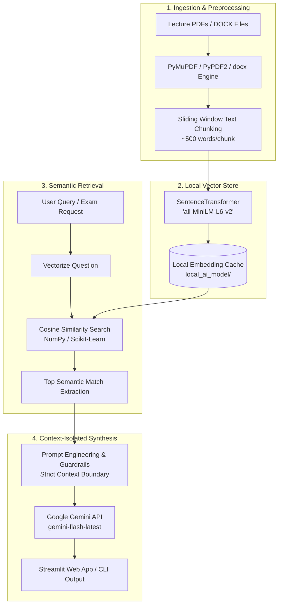

# 🧠 NeuralNotes

<div align="center">

[](https://www.python.org/)
[](https://streamlit.io/)
[](https://ai.google.dev/)
[](https://huggingface.co/sentence-transformers/all-MiniLM-L6-v2)
[](#-technical-architecture)
[](LICENSE)
[](https://github.com/kailash6207/NeuralNotes/pulls)

**NeuralNotes** is an intelligent, high-performance academic assistant and exam preparation engine designed specifically for engineering students. Powered by a local **Retrieval-Augmented Generation (RAG)** pipeline and **Google Gemini**, NeuralNotes transforms dense, hundred-page syllabus documents, lecture slides, and question banks into an interactive, context-grounded study companion.

[Key Features](#-key-features) •
[Architecture](#-technical-architecture) •
[Tech Stack](#-tech-stack) •
[Quickstart](#-quickstart-guide) •
[Study Tools](#-study-tools-breakdown) •
[Project Structure](#-project-structure) •
[Troubleshooting](#-troubleshooting--faq)

</div>

---

## 📌 Why NeuralNotes?

Engineering curricula (such as those at **VIT Chennai** for CAT & FAT exams) involve massive syllabi spanning dense topics like **VLSI Design, CMOS Circuitry, Digital Signal Processing (DSP), Embedded Systems, and Microcontrollers**. 

Standard AI chatbots frequently:
1. **Hallucinate formulas and derivations** that deviate from course syllabi.
2. **Lose track of course-specific notations and conventions**.
3. **Cannot ingest multi-chapter PDFs and Word documents simultaneously**.

**NeuralNotes** solves this by establishing a strict, closed-loop RAG boundary: it grounds every explanation, quiz question, and flashcard **exclusively in your uploaded lecture notes and reference textbooks**. If a concept isn't in your notes, it won't fabricate an answer.

---

## ✨ Key Features

| Feature | Description |
| :--- | :--- |
| 💬 **Context-Grounded Q&A** | Ask questions about any uploaded document. The assistant retrieves relevant passages using local semantic search and answers strictly based on your course material. |
| 📝 **Automated Mock FAT Quizzes** | Generates 10-question multiple-choice practice exams formatted in clean Markdown, complete with an answer key and rationale tucked away at the bottom. |
| 📇 **High-Yield Flashcard Deck** | Synthesizes rapid-fire revision flashcards with targeted questions and concise answers for last-minute cramming sessions. |
| 👶 **ELI5 Concept Explainer** | Breaks down daunting engineering concepts into intuitive, real-world analogies with **strict mathematical guardrails** to preserve equation accuracy. |
| 📂 **Multi-Format Ingestion** | Seamlessly parse and chunk both `.pdf` and `.docx` lecture materials simultaneously. |
| 💾 **Persistent Session Memory** | Preserves chat conversations across page reloads via a local JSON cache (`chat_history.json`) with one-click disk wiping. |
| 🖥️ **Dual Interface Support** | Use the full-featured **Streamlit Web GUI** or run lightweight terminal study sessions via the standalone **CLI Tutor** (`tutor.py`). |
| ⚡ **Offline-First Vector Store** | Computes and caches embeddings locally using `all-MiniLM-L6-v2`, eliminating cloud embedding API latency and costs. |

---

## 🏗️ Technical Architecture

NeuralNotes uses a multi-stage RAG pipeline optimized for local speed and high generative fidelity:



### Pipeline Details:
1. **Document Parsing (`pdf_engine.py`)**: Extracts raw text from `.pdf` and `.docx` files, filtering out empty artifacts and normalizing whitespace.
2. **Chunking Engine**: Breaks down continuous text streams into uniform 500-word contextual chunks suitable for transformer attention windows.
3. **Local Embedding (`vector_store.py`)**: Vectorizes text chunks using HuggingFace's `sentence-transformers/all-MiniLM-L6-v2`. Embeddings are stored in-memory and cached in `local_ai_model/` with Windows symlink protections enabled.
4. **Similarity Retrieval**: When a query is made, its embedding is compared against chunk vectors using cosine similarity to extract the highest-scoring source context.
5. **Generative Inference (`app.py` & `tutor.py`)**: Prompts Google Gemini with context isolation to deliver grounded responses, quizzes, or flashcards.

---

## 💻 Tech Stack

- **Large Language Model**: [Google Gemini API](https://ai.google.dev/) via the official `google-genai` SDK (`gemini-flash-latest` / `gemini-pro`)
- **Embeddings**: [SentenceTransformers](https://sbert.net/) (`all-MiniLM-L6-v2`)
- **Vector Math**: [Scikit-Learn](https://scikit-learn.org/) (Cosine Similarity) & [NumPy](https://numpy.org/)
- **Document Extractors**: [PyMuPDF](https://pymupdf.readthedocs.io/) / [PyPDF2](https://pypdf2.readthedocs.io/) & [python-docx](https://python-docx.readthedocs.io/)
- **Frontend Framework**: [Streamlit](https://streamlit.io/)
- **Language**: Python 3.9+

---

## 📂 Project Structure

```text
NeuralNotes/
├── 📄 app.py              # Main Streamlit web application with reactive UI & state
├── 📄 tutor.py            # Standalone terminal-based CLI study assistant
├── 📄 pdf_engine.py       # Document parser & chunking engine for PDF & DOCX
├── 📄 vector_store.py     # SentenceTransformer embeddings & cosine similarity matcher
├── 📄 test_key.py         # Diagnostic utility to verify Google Gemini API connectivity
├── 📄 check.py            # Utility to inspect available & authorized Gemini models
├── 📄 requirements.txt    # Python dependencies
├── 📄 chat_history.json   # Local persistent conversation storage (auto-generated)
├── 📁 uploads/            # Default directory for syllabus & lecture notes (auto-generated)
└── 📁 local_ai_model/     # Local cache directory for HuggingFace transformer weights
```

---

## 🚀 Quickstart Guide

### 1. Clone the Repository
```bash
git clone https://github.com/kailash6207/NeuralNotes.git
cd NeuralNotes
```

### 2. Set Up a Virtual Environment
It is recommended to use a clean virtual environment:

```bash
# Windows (PowerShell)
python -m venv venv
.\venv\Scripts\Activate.ps1

# Linux / macOS
python3 -m venv venv
source venv/bin/activate
```

### 3. Install Dependencies
```bash
pip install -r requirements.txt
```

### 4. Configure Your Google Gemini API Key

1. Obtain a free API key from [Google AI Studio](https://aistudio.google.com/).
2. You can configure your key in either of the following ways:

#### Option A: Set via Environment Variable (Recommended)
```bash
# Windows PowerShell
$env:GOOGLE_API_KEY="your_actual_api_key_here"

# Linux / macOS
export GOOGLE_API_KEY="your_actual_api_key_here"
```

#### Option B: In-Code Configuration
Update `GOOGLE_API_KEY = "YOUR_API_KEY_HERE"` in `app.py` and `tutor.py`.

### 5. Verify API Connectivity
Run the included test script to ensure your key is valid and responsive:
```bash
python test_key.py
```
*You should see:* `✅ SUCCESS: The key is perfect!`

### 6. Launch the Application

#### 🌐 Launch Streamlit Web UI:
```bash
streamlit run app.py
```
Open your browser at `http://localhost:8501`.

#### 💻 Launch Terminal CLI Tutor:
```bash
python tutor.py
```

---

## 🛠️ Study Tools Breakdown

### 1. 📝 Practice Exam Generator
Click **"Generate Practice Exam"** in the sidebar. NeuralNotes samples representative chunks from your course material and commands Gemini to construct a structured 10-question MCQ quiz.
- Questions adhere to university testing formats.
- Answer keys with concise explanations are rendered at the bottom to enable self-assessment without spoiling answers.

### 2. 📇 High-Yield Flashcards
Click **"Generate Flashcards"** to convert dense sections of text into high-impact `Q:` / `A:` pairs covering definitions, acronyms, and critical engineering formulas.

### 3. 👶 Concept Simplifier (ELI5)
Stuck on an intricate proof, semiconductor energy band diagram, or convolution theorem?
- NeuralNotes inspects the last response given by the tutor.
- It prompts the LLM to rewrite the explanation using concrete everyday analogies.
- **Strict Guardrail**: The system prompt strictly enforces that equations and physical properties remain technically accurate without altering laws of physics to satisfy an analogy.

---

## 🔧 Troubleshooting & FAQ

<details>
<summary><b>1. Windows Hugging Face Symlink Warning</b></summary>

On Windows systems without Developer Mode enabled, HuggingFace may raise a symlink warning. NeuralNotes automatically bypasses this at startup via:
```python
os.environ['HF_HUB_DISABLE_SYMLINKS'] = '1'
os.environ['HF_HUB_DISABLE_SYMLINKS_WARNING'] = '1'
```
No manual intervention is required.
</details>

<details>
<summary><b>2. ModuleNotFoundError: No module named 'utils'</b></summary>

If your environment expects `utils.pdf_engine` or `utils.vector_store`, ensure your current working directory is the repository root, or create a `utils/` package containing `pdf_engine.py` and `vector_store.py` with an empty `__init__.py`.
</details>

<details>
<summary><b>3. PyPDF2 vs. PyMuPDF Ingestion Differences</b></summary>

`requirements.txt` includes `PyMuPDF` for high-speed PDF text parsing, while `pdf_engine.py` uses `PyPDF2`. Both libraries extract text effectively. If you wish to switch to PyMuPDF (`fitz`), replace the reader loop in `pdf_engine.py` with `fitz.open(file_path)`.
</details>

<details>
<summary><b>4. How to clear chat history from disk?</b></summary>

Click the **"🧹 Clear Chat History"** button in the Streamlit sidebar. This clears `st.session_state` and removes `chat_history.json` from disk.
</details>

---

## 🗺️ Roadmap

- [ ] **OCR & Handwritten Notes Parsing**: Support for lecture blackboard snapshots and handwritten student notebooks via Gemini Vision.
- [ ] **Formula & LaTeX Rendering**: Native KaTeX formatting for complex mathematical formulas and circuit diagrams.
- [ ] **Anki Deck Export**: Direct export of generated flashcards to `.apkg` files for spaced repetition.
- [ ] **Custom Chunk Size Slider**: In-app UI control to toggle retrieval granularity between 250 and 1,000 words.
- [ ] **Local LLM Support**: Offline inference toggle using Ollama / LLaMA 3 for completely air-gapped study environments.

---

## 🤝 Contributing

Contributions are welcome! Whether you are adding support for new document types, refining RAG prompts, or polishing the UI:

1. **Fork** the repository.
2. **Create a feature branch**:
   ```bash
   git checkout -b feature/AmazingFeature
   ```
3. **Commit your changes**:
   ```bash
   git commit -m "Add AmazingFeature"
   ```
4. **Push to your branch**:
   ```bash
   git push origin feature/AmazingFeature
   ```
5. **Open a Pull Request**.

---

## 📄 License

Distributed under the **MIT License**. See `LICENSE` for more information.

---

<div align="center">

Built with 💡 for engineering students. Star ⭐ this repository if it helped your exam prep!

</div>
